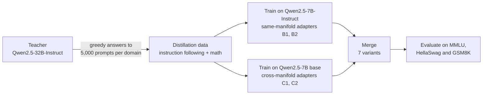
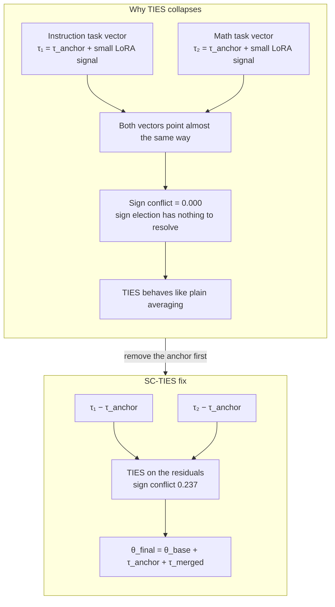
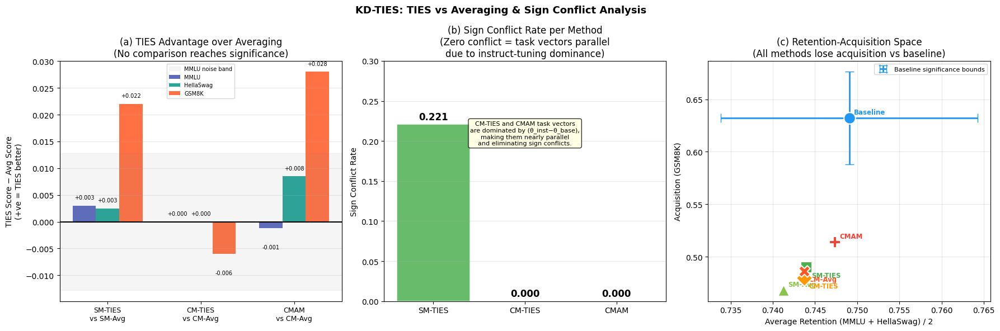
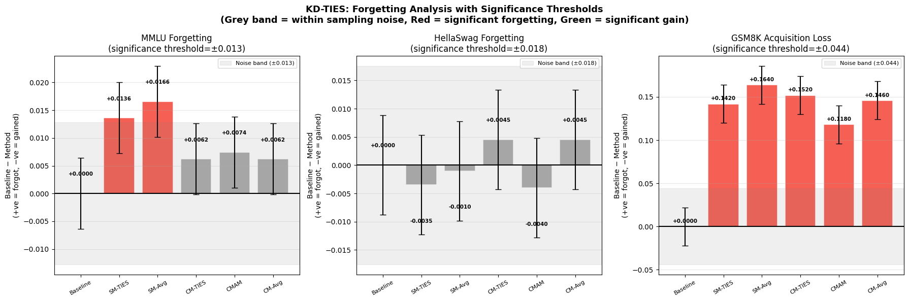
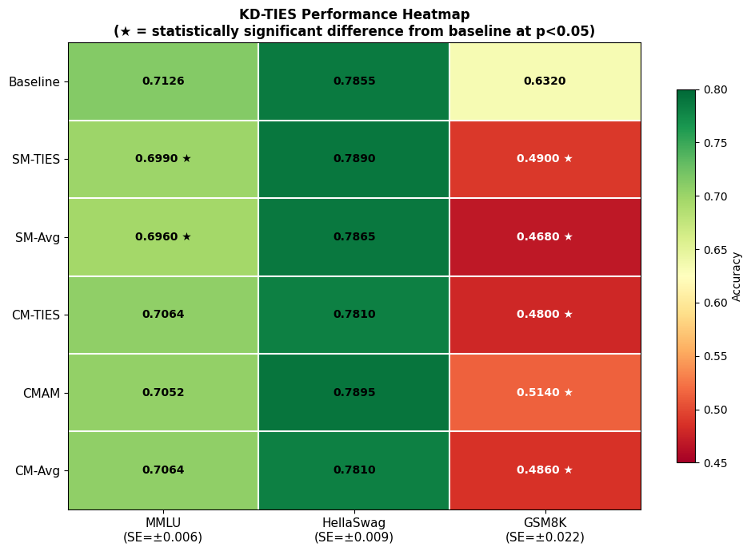
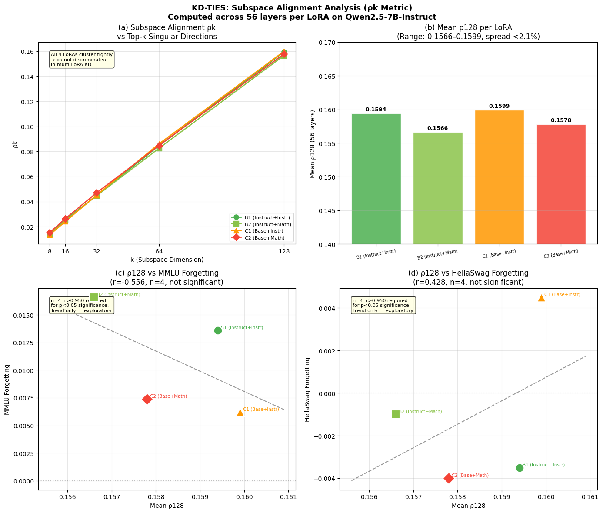
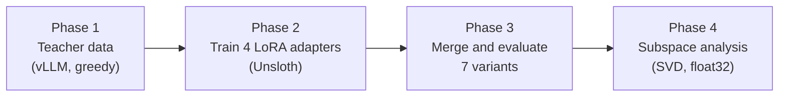

# KD-TIES: cross-manifold LoRA merging in knowledge distillation

I wanted to know whether TIES merging could combine two skills, instruction following and math reasoning, when each skill sits in a LoRA adapter trained by distilling Qwen2.5-32B into Qwen2.5-7B. It can't, at least not the way I first set it up. This repo shows why, and tests two fixes.

This is my M.Sc. thesis at the Central University of Rajasthan (Dec 2025 to Jun 2026).

## Key findings

| # | Finding | Evidence |
|---|---|---|
| 1 | Distillation hurt math before any merge happened | The individual math adapters score 0.466 on GSM8K, against a 0.642 baseline |
| 2 | With cross-manifold adapters, sign conflict is 0.000 and TIES acts like plain averaging | CM-TIES and CM-Avg are within 0.006 on every benchmark, and identical on MMLU and HellaSwag |
| 3 | In the standard setups, TIES never beats averaging by a significant margin | No pairwise difference exceeds 2×SE on any benchmark |
| 4 | SC-TIES gives the only significant gain between methods | +0.017 MMLU over SM-TIES, against a threshold of 0.013 |
| 5 | OP-TIES keeps commonsense best | HellaSwag 0.792, and subspace interference ρ₁₆ falls from 0.026 to 0.000 |
| 6 | Merging several adapters recovers some math | CMAM scores 0.514 on GSM8K against 0.466 for the individual adapters, still below the 0.642 baseline |

## The setup

Qwen2.5-32B-Instruct is the teacher. It answers 5,000 prompts in each of two domains: instruction following (a GPT-4 dataset) and math reasoning (MetaMathQA, GSM_AnsAug). I train a LoRA adapter on each domain, in two ways:

- **Same-manifold adapters (B1, B2)** are trained on Qwen2.5-7B-Instruct.
- **Cross-manifold adapters (C1, C2)** are trained on the Qwen2.5-7B base model, and their task vectors are measured against that base.

The evaluation target is Qwen2.5-7B-Instruct, scored on MMLU, HellaSwag and GSM8K.



## Why TIES stopped doing anything

TIES works by sign election. When two task vectors disagree about the sign of a parameter, it resolves the conflict. For that to matter, the vectors have to disagree somewhere.

A cross-manifold task vector is computed like this:

```
τ = θ_LoRA_on_TARGET − θ_BASE
```

That difference contains the entire instruct-tuning shift:

```
τ_anchor = θ_inst − θ_base
```

`τ_anchor` is orders of magnitude larger than the LoRA signal. Both task vectors therefore point in nearly the same direction, and the measured sign conflict is 0.000. TIES has nothing to resolve and turns into plain averaging without any error or warning.



### The two fixes

**SC-TIES** subtracts the anchor, merges what is left, then puts the anchor back. Sign conflict goes from 0.000 to 0.237.

```
τ_corrected = τ_cross − τ_anchor
τ_merged    = TIES(τ_corrected)
θ_final     = θ_base + τ_anchor + τ_merged
```

**OP-TIES** projects the shared top-16 subspace out of each weight update before merging. Subspace interference ρ₁₆ goes from 0.026 to 0.000.

```
ΔW_projected = P_L · ΔW · P_R
where P_L = I − U₁₆U₁₆ᵀ and P_R = I − V₁₆V₁₆ᵀ
```

## The seven variants

| Name | What it is |
|---|---|
| Baseline | Qwen2.5-7B-Instruct with no adapters |
| SM-TIES, SM-Avg | The two same-manifold adapters, merged with TIES or by simple averaging |
| CM-TIES, CM-Avg | The two cross-manifold adapters, merged with TIES or by simple averaging |
| SC-TIES | Cross-manifold adapters with the anchor removed before the TIES merge |
| OP-TIES | Cross-manifold adapters with the shared subspace projected out |

TIES settings for every variant: retention density ρ = 0.70, sign election by the sum of signed magnitudes, and the merged value is the mean of the parameters that agree.

## Results

| Method | MMLU | HellaSwag | GSM8K | Sign conflict |
|---|---|---|---|---|
| Baseline | 0.713 | 0.786 | 0.642 | n/a |
| SM-TIES | 0.699 ★ | 0.789 | 0.490 ★ | 0.221 |
| SM-Avg | 0.696 ★ | 0.787 | 0.468 ★ | n/a |
| CM-TIES | 0.706 | 0.781 | 0.480 ★ | 0.000 |
| CMAM | 0.705 | 0.790 | 0.514 ★ | 0.000 |
| CM-Avg | 0.706 | 0.781 | 0.486 ★ | n/a |
| **SC-TIES** | **0.716** | 0.786 | 0.452 ★ | 0.237 |
| **OP-TIES** | 0.711 | **0.792** | 0.484 ★ | 0.414 |

★ means the difference from the baseline is larger than 2×SE. SC-TIES and OP-TIES are the two methods I proposed.

Two things the table does not make obvious:

- SC-TIES scores 0.716 on MMLU against a 0.713 baseline, which is not significant. The significant result is the +0.017 over SM-TIES, a comparison between methods.
- Every merge variant loses GSM8K against the baseline, including both of mine. SC-TIES has the lowest GSM8K score of all (0.452). Distillation had already cut math before any merge happened.

### Figures






## Limitations

- Everything here is one model family: a Qwen2.5-32B teacher and a Qwen2.5-7B student, two domains, 5,000 samples each, one epoch of training.
- The only significant gain between methods is +0.017 on one benchmark (MMLU).
- Neither of my fixes recovers GSM8K, so they do not solve the problem that started this project. They explain why TIES failed and repair the merge geometry, and that is all they do.

## What I would do differently

I measured sign conflict only after the merge failed to help. If I had instrumented it from the first run, the diagnosis would have taken days instead of weeks. I was watching the benchmark score when the zero was the louder signal.

## The pipeline



| Phase | Notebook | What it does |
|---|---|---|
| 1 | `phase1_data_generation.ipynb` | Batch inference from the 32B teacher with vLLM at temperature 0 (greedy). About 15 minutes per domain on an A100. |
| 2 | `phase2_lora_training.ipynb` | Supervised fine-tuning with Unsloth. Four adapters: B1 and B2 (same-manifold), C1 and C2 (cross-manifold). About 170 MB per adapter. |
| 3 | `phase3_merge_and_evaluation.ipynb` | In-memory TIES merge, never written to disk. Seven variants evaluated one after another, with results saved to `results.json` after each. |
| 4 | `phase4_subspace_analysis.ipynb` | The ρk metric for k in {8, 16, 32, 64, 128}, over 56 layers and 4 adapters. float32 is required for stable SVD. |

### Configuration

```
Teacher:         Qwen2.5-32B-Instruct   (generates the distillation data)
Student target:  Qwen2.5-7B-Instruct    (evaluation baseline)
Student base:    Qwen2.5-7B             (cross-manifold training base)

Domains:
  D1  instruction following   GPT-4 dataset, 5,000 samples
  D2  math reasoning          MetaMathQA GSM_AnsAug, 5,000 samples

LoRA:  rank 16, alpha 16, dropout 0.0, all 7 modules (q, k, v, o, gate, up, down)
Train: 1 epoch, learning rate 2e-4, batch 2, gradient accumulation 4
```

### Environment

```
GPU:   A100 (102GB VRAM)
RAM:   30GB CPU RAM for task vector storage
Disk:  20GB working limit (Kaggle)
```

vLLM and Unsloth cannot share a Python session, so run each notebook in a fresh kernel and in order.

### Main dependencies

```
torch>=2.0.0
transformers>=4.40.0
peft>=0.10.0
datasets>=2.18.0
vllm==0.4.2
unsloth
tqdm
numpy
scipy
```

## Trained adapters

All four adapters are on Kaggle as one dataset: [kaggle.com/datasets/rrishavrraj/all-new-lora](https://www.kaggle.com/datasets/rrishavrraj/all-new-lora)

| Adapter | Manifold | Base model | Domain |
|---|---|---|---|
| lora_B1 | Same-manifold | Qwen2.5-7B-Instruct | Instruction following |
| lora_B2 | Same-manifold | Qwen2.5-7B-Instruct | Math reasoning |
| lora_C1 | Cross-manifold | Qwen2.5-7B | Instruction following |
| lora_C2 | Cross-manifold | Qwen2.5-7B | Math reasoning |

Total size is 691 MB (about 170 MB each). Each adapter: r=16, alpha=16, dropout 0.0, 7 modules, 1 epoch, 5,000 samples.

## Repository layout

```
KD-ties/
├── README.md
├── phase1_data_generation.ipynb
├── phase2_lora_training.ipynb
├── phase3_merge_and_evaluation.ipynb
├── phase4_subspace_analysis.ipynb
└── figures/
    ├── forgetting_analysis.png
    ├── heat_maps.png
    ├── sign_conflict_comparison.png
    └── subspace_alignment.png
```

## Thesis

**Title:** Cross-Manifold Task Vectors and TIES Degeneration in Knowledge Distillation Pipelines
**Institution:** Central University of Rajasthan, Department of Computer Science
**Supervisor:** Dr. Gaurav Meena

The full thesis PDF is available on request: rrishavrraj@gmail.com

## Citation

```bibtex
@mastersthesis{raj2026kdties,
  author     = {Rishav Raj},
  title      = {Cross-Manifold Task Vectors and TIES Degeneration
                in Knowledge Distillation Pipelines},
  school     = {Central University of Rajasthan},
  year       = {2026},
  month      = {June},
  department = {Department of Computer Science}
}
```
